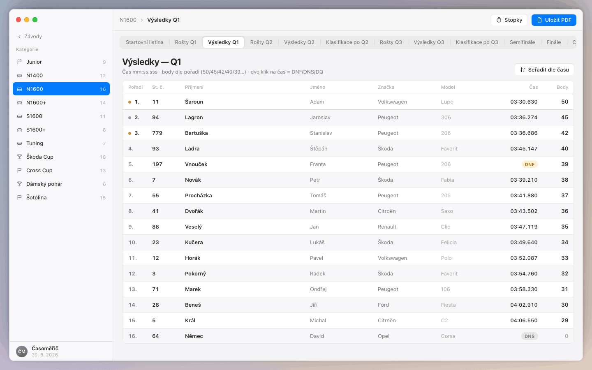

# Časomíra

Desktopová aplikace pro **časoměřičství autokrosu a rallycrossu** — náhrada sady Excelových sešitů jedním offline programem pro Windows a macOS.

Jeden operátor, jeden počítač, žádná síť. Data v lokální SQLite. Pravidla RAC Race (Hobby), RX Cup a Šotolina podle časoměřičské bible, v MVP co nejvěrněji stávajícímu workflow.

<p align="center">
  
</p>

---

## Stáhnout

Instalátory najdeš u **[GitHub Releases](https://github.com/Vituhlos/casomira/releases)** (po vydání tagu, např. `v0.9.0`):

| Platforma | Soubor |
|-----------|--------|
| Windows | `Casomira-Setup-x.y.z.exe` — NSIS instalátor (Start menu, odinstalace) |
| macOS | `Casomira-x.y.z.dmg` |

Bez release tagu můžeš sestavit lokálně — viz [BUILD.md](./BUILD.md).

---

## Co umí (MVP)

- **Závod** RAC / RX při založení; **kategorie** se samostatnými pravidly (`STANDARD` / `Šotolina`)
- Startovní listina, import z `.xls` / `.xlsx`
- Rošty s autofill podle startovního čísla
- Výsledky: vložení časů ze schránky (Free Stopwatch), automatické pořadí a body, stavy DNF / DNS / DQ
- Klasifikace po Q2 / Q3 včetně tiebreaku dle formátu
- Semifinále, finále, finále A/B (Šotolina), celkové výsledky
- **PDF** — WYSIWYG export obrazovky (jako dnešní VBA v Excelu)
- **Penalizace ředitele** — časová, bodová, posun pořadí + auditní log zásahů
- Vestavěné **stopky** (mezerník / Backspace), světlý a tmavý režim

Plánované rozšíření (fáze 2): auto-seedování roštů, auto SF/finále, záloha závodu, další validace — viz [CLAUDE.md](./CLAUDE.md).

---

## Požadavky

- **Node.js** 22 LTS (vývoj i sestavení instalátoru)
- **Windows 10+** nebo **macOS** (běh aplikace)
- Instalátor pro Mac se balí na Macu nebo v GitHub Actions

---

## Vývoj

```bash
git clone https://github.com/Vituhlos/casomira.git
cd casomira
npm install
npm run dev
```

| Příkaz | Popis |
|--------|--------|
| `npm run dev` | Vývojový režim (Electron + Vite) |
| `npm run build` | Kompilace do `out/` |
| `npm run typecheck` | TypeScript kontrola |
| `npm run dist:win` | Windows instalátor → `release/` |
| `npm run dist:mac` | macOS DMG → `release/` |

Podrobný návod k balení a řešení EPERM při buildu: **[BUILD.md](./BUILD.md)**.

---

## Vydání na GitHubu

Po pushnutí tagu `v*` (např. `v0.9.0`) workflow [`.github/workflows/release.yml`](./.github/workflows/release.yml) sestaví instalátory na Windows i Mac a přiloží je k release.

```bash
git tag v0.9.0
git push origin v0.9.0
```

---

## Technologie

Electron · React · Vite · TypeScript · `better-sqlite3` · SheetJS (`xlsx`) · electron-builder (NSIS / DMG)

Vizuální základ vychází z prototypu ve složce [`Casomira-macOS/`](./Casomira-macOS/) (designové tokeny `mac.css`); produkční logika bodování a klasifikace je v `src/main/`.

---

## Struktura repozitáře

```
src/
  main/          # Electron main, SQLite, pravidla, IPC
  renderer/      # React UI
  preload/       # Bezpečný most renderer ↔ main
  shared/        # Sdílené typy
Casomira-macOS/  # Původní klikací prototyp (reference vzhledu)
build/           # Ikony pro instalátor (volitelné)
```

---

## Licence

Soukromý projekt — **všechna práva vyhrazena** (`UNLICENSED` v `package.json`). Není určeno jako open source, dokud autor výslovně neurčí jinak.

---

## Kontakt / autor

Repozitář: [@Vituhlos/casomira](https://github.com/Vituhlos/casomira)
