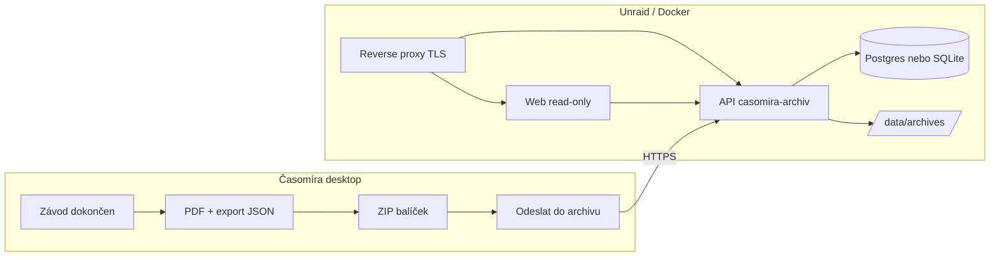

# Plán — self-hosted archiv závodů (Unraid + Docker + vlastní doména)

> **Účel:** Shrnutí diskuse pro další rozbor s Claude Code / uživatelem.  
> **Stav:** návrh, bez implementace v repu. Desktop Časomíra zůstává offline na závod; archiv je **po závodě**.

---

## Kontext projektu

**Časomíra** nahrazuje Excelové sešity pro časoměření rallycross / autocross. MVP = jeden operátor, jeden počítač, **plně offline**, data v lokální SQLite.

**Dnešní archivace (Excel):** všechny soubory → OneDrive, uchovávat cca 3 roky, procházetelný archiv.

**Cíl uživatele:** mít podobnou „vitrínu“ minulých závodů, ale na **vlastní infrastruktuře** (Unraid, Docker, vlastní doména) — ne nutně jen OneDrive. Desktop po závodě nahraje balíček; web jen **prohlíží** (read-only), včetně dat ze stopek ze zálohy.

---

## Úrovně řešení (jak jsme to rámovali)

| Úroveň | Popis | Kdy |
|--------|--------|-----|
| **A** | ZIP / složka: JSON záloha + PDF → ručně nebo sync na OneDrive | nejjednodušší, lze hned |
| **B** | Read-only web archiv: upload balíčku, prohlížení závodů | cíl na vlastním serveru |
| **B+** | B + tlačítko v desktopu → HTTPS upload na vlastní API | uživatelův směr |
| **C** | Plná webová appka (měření, editace, více operátorů) | **mimo rozsah** — konkurovalo by Electronu |

**Rozhodnutí:** závod se vede v desktopu; cloud/archiv až **po závodě** (snapshot). Žádná živá synchronizace SQLite do cloudu v MVP archivu.

---

## Co už v desktopu existuje (základ pro archiv)

- Formát **`casomira-backup`** (JSON, verze 1) — export/import závodu.
- Export přes IPC `backup:exportZavod` / `exportZavodBackup`.
- Záloha obsahuje mimo jiné: závod, kategorie, jezdce, kola, jízdy, rošty, **výsledky**, **`mereni`** (stopky), `uprava_log`, …
- PDF export z obrazovek (WYSIWYG) — soubory vedle JSON v balíčku.

**Důležité:** web v první fázi **nepřepočítává** body podle bible — zobrazuje uložené hodnoty z JSON (jinak duplicita pravidlové logiky oproti desktopu).

Související kód: `src/main/backup/`, `src/shared/backup`, IPC v `src/main/ipc.ts`.

---

## Cílová architektura (Unraid)



**Princip:** jeden upload = **neměnný snapshot** jednoho závodu. Archiv není druhá „živá“ databáze závodu.

---

## Formát balíčku (navrhovaný)

Rozšíření dnešního exportu o ZIP + manifest:

```
MCR-Prerov-2026-05-30.zip
├── manifest.json          # metadata: id závodu, název, datum, místo, typ RAC/RX,
│                          # schemaVersion, verze app, seznam PDF
├── backup.json            # casomira-backup v1 (celý payload závodu)
└── pdf/
    ├── Startovní_listina_N1600.pdf
    ├── Q1_výsledky_N1600.pdf
    └── …                  # stejné názvy jako dnes u PDF exportu
```

**Proč ZIP:** jeden POST z desktopu, snadná kopie na OneDrive jako druhá záloha, jednoduché zálohování svazku na Unraid.

**manifest.json** (orientačně): `raceId`, `nazev`, `datum`, `misto`, `typ`, `uploadedAt`, `appVersion`, `backupFormatVersion`, `pdf[]` s cestami a `kategorie` pokud je v názvu souboru.

---

## Docker stack (minimální návrh)

| Služba | Účel |
|--------|------|
| **casomira-archiv-api** | `POST` upload, index závodů, `GET` detail, servírování PDF |
| **casomira-archiv-web** | SPA — seznam závodů, kategorie, PDF, později tabulky ze JSON |
| **Postgres** (nebo SQLite na volume) | index závodů; volitelně `jsonb` nebo jen cesta k `backup.json` na disku |
| **Traefik / Nginx Proxy Manager** | TLS, subdoména (uživatel má doménu) |
| **Volitelně Authelia / forward auth** | přístup jen pro klub / časoměřiče |

**Záměrně ne v první verzi:** rules engine na serveru, live závod, editace výsledků v prohlížeči.

---

## Web — fáze funkcí

### Fáze 1 — katalog + PDF (MVP archivu)

- Seznam závodů (rok, název, místo, typ)
- Detail → kategorie → odkazy na PDF
- Stažení celého ZIP závodu

### Fáze 2 — read-only jako v appce

- Tabulky: startovka, rošty, výsledky, klasifikace (z JSON)
- **Stopky:** zobrazení `mereni` podle jízdy (pořadí kliku, čas, přiřazené startovní číslo)
- Vyhledání jezdce v rámci závodu

### Fáze 3 — pohodlí

- Filtry (rok, RAC/RX), fulltext v názvech
- Fronta uploadu z desktopu („odeslat později“)
- Automatický upload po závodě (volitelné)

---

## Upload z desktopu (budoucí chování)

1. Operátor dokončí závod, exportuje PDF (jako dnes).
2. `exportZavodBackup` → `backup.json` do ZIP.
3. Tlačítko **„Odeslat do archivu“** (Settings: URL API + token).
4. `POST /api/races` — multipart nebo celý ZIP, hlavička `Authorization: Bearer <token>`.
5. API uloží na disk, validuje `casomira-backup`, zapíše index.
6. UI: úspěch + odkaz na web (`https://archiv.example.cz/races/...`).

Pokud síť nejde: uložit ZIP lokálně, později znovu (fronta — nice-to-have).

**Nový kód v Electronu (až implementace):** např. `archiv:upload`, nastavení v Settings — **zatím neexistuje**.

---

## Úložiště na Unraid

```
/mnt/user/archiv-casomira/
  races/
    2024/
      2024-06-12__mcr-autocross__<uuid>/
        bundle.zip
        extracted/     # volitelně po rozbalení
    2026/
      ...
```

- Retence 3 roky: cron nebo ruční úklid starých složek.
- Záloha svazku Unraid = DR; OneDrive může držet **stejné ZIP** jako druhá kopie (úroveň A paralelně).

**Nginx/proxy:** zvýšit `client_max_body_size` kvůli velkým ZIP (PDF × kategorie).

---

## Autentizace a viditelnost (otevřené rozhodnutí)

| Model | Poznámka |
|-------|----------|
| **Soukromý archiv** (Authelia, VPN, Basic Auth) | vhodné kvůli jménům jezdců v JSON |
| **Veřejný read-only** | GDPR — spíš jen PDF bez citlivých detailů |
| **Hybrid** | veřejně PDF, plná data za přihlášením |

**Doporučení z diskuse:** celý archiv spíš **za přihlášením**; veřejné výsledky nechat na klubovém webu / OneDrive, pokud je potřeba.

---

## Rizika a pasti

1. **Dvě pravdy** — po uploadu archiv neaktualizuje desktop; změna v appce = nový upload nebo verze „přepsat“.
2. **Duplicita pravidel** — web nemá přepočítávat body; jen zobrazit `poradi`, `body`, stavy z JSON.
3. **Verze zálohy** — API musí odmítnout nebo migrovat neznámou `backupFormatVersion`.
4. **Timeout uploadu** — velké závody, mnoho PDF.
5. **Osobní údaje** — rok narození, jména v JSON; politika přístupu musí být jasná.

---

## Doporučené pořadí implementace

1. Specifikace `manifest.json` + ZIP layout (tento dokument + případně JSON Schema).
2. Monorepo: složka **`apps/archiv`** (viz [plan-monorepo-layout.md](./plan-monorepo-layout.md)) — API + minimální web; přesun desktopu do `apps/desktop` ve stejném kroku.
3. `docker-compose.yml` pro Unraid, volume, env (DB URL, API token, cesta `/data`).
4. API: upload, list, detail, statické PDF.
5. Web fáze 1: seznam + PDF.
6. Desktop: sestavení ZIP + POST (závisí na API).
7. Web fáze 2: tabulky + stopky z `mereni`.
8. Auth (Authelia) + produkční doména.

---

## Co záměrně není v tomto plánu

- SaaS / cizí cloud jako jediné úložiště (uživatel chce vlastní server).
- Nahrazení Electron appky pro provoz závodu.
- Automatický sync živé SQLite.
- Přepočet klasifikace / tiebreaku na serveru.
- Mobilní zadávání přes síť (fáze 2 produktu, jiné téma).

---

## Související témata z jiných diskusí (jen reference)

- **Stopky / přesnost:** lidská reakce dominuje; vestavěné stopky v desktopu, data v `mereni` — archiv je jen zobrazí ze zálohy.
- **Bug zavírání oken stopek:** viz [plán-oprava-zavirani-stopek.md](./plán-oprava-zavirani-stopek.md) (titulek okna + IPC) — nezávislé na archivu.
- **Aktualizace desktopu (OneDrive manifest):** oddělené TODO v konverzaci — nesplést s archivem závodů.

---

## Otevřené otázky k rozhodnutí s Claudem / uživatelem

- [ ] Přesná **subdoména** a jestli archiv běží za VPN, nebo jen HTTPS + login.
- [ ] **Postgres vs. SQLite** v Dockeru (pro jednoho provozovatele stačí SQLite na volume).
- [ ] Jazyk API (Node jako desktop stack vs. Python/Go).
- [ ] První verze webu: stačí **PDF + katalog**, nebo hned **tabulky + stopky**?
- [ ] Politika **přepsání** uploadu stejného závodu (stejný den, oprava dat).
- [ ] Paralelní **OneDrive** (ruční kopie ZIP) — ano/ne jako povinný workflow.
- [x] Kde žije repozitář archivu: **monorepo** `apps/archiv` + `packages/shared` — viz [plan-monorepo-layout.md](./plan-monorepo-layout.md).

---

## Shrnutí jednou větou

**Po závodě desktop pošle ZIP (JSON `casomira-backup` + PDF) na vlastní API na Unraid; read-only web slouží jako dlouhodobý prohlížeč archivu včetně stopky — bez editace a bez závodního provozu v prohlížeči.**

---

*Dokument vytvořen z diskuse v Cursoru (únor 2026). Upravovat při rozhodnutích s Claude Code.*
