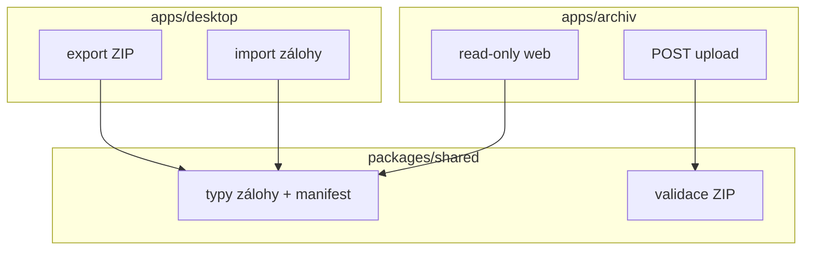

# Plán — monorepo layout (desktop + archiv)

> **Účel:** Cílová struktura jednoho repozitáře `casomira` se dvěma aplikacemi.  
> **Stav:** návrh — **neimplementovat** dokud nezačne vývoj `apps/archiv` (první API nebo Docker).  
> **Souvisí s:** [plan-archiv-web-unraid.md](./plan-archiv-web-unraid.md) (funkce archivu), [BUILD.md](./BUILD.md) (dnešní build desktopu).

---

## Proč monorepo

| Důvod | Detail |
|-------|--------|
| Jeden clone | Desktop i archiv u tebe na disku / v Cursoru (`casomira-kotlina` = workspace). |
| Sdílený kontrakt | Formát `casomira-backup`, `manifest.json`, ZIP balíček — jedna verze typů v `packages/shared`. |
| Jedna historie | Změna schématu zálohy = jeden PR, desktop export + archiv validace. |
| Oddělený deploy | Desktop → GitHub Releases; archiv → Docker na Unraid (jiný pipeline). |

**Nedělat předčasně:** prázdná `apps/archiv/` v repu bez kódu — mate lidi i AI. Přesun na monorepo = **jeden krok** v den, kdy zakládáš archiv.

---

## Stav dnes vs. cíl

### Dnes (po úrovni B)

```
casomira/                 # kořen git repa
├── src/                  # Electron app
├── package.json          # jeden projekt
├── docs/, reference/, fixtures/, build/, scripts/
└── …
```

### Cíl (monorepo)

```
casomira/
├── package.json              # workspaces root (bez vlastní app logiky)
├── pnpm-workspace.yaml       # nebo npm workspaces v package.json
├── apps/
│   ├── desktop/              # dnešní Časomíra (Electron)
│   └── archiv/               # API + read-only web + Docker
├── packages/
│   └── shared/               # typy zálohy, manifest, validace
├── docs/                     # společná dokumentace (user + dev + prompts)
├── reference/                # prototyp Casomira-macOS (design reference)
├── fixtures/                 # ukázky pro desktop import (volitelně přesun pod desktop)
├── scripts/                  # release-notes, sdílené utility
├── .github/workflows/        # release desktop; později build/deploy archiv
├── CLAUDE.md                 # bible pravidel závodu (celý produkt)
├── README.md                 # přehled monorepa + odkazy na apps
└── CHANGELOG.md              # primárně desktop; archiv vlastní sekce nebo soubor
```

---

## `apps/desktop` — obsah přesunu

Vše z dnešního kořene kromě archivu a shared:

| Z kořene | Kam |
|----------|-----|
| `src/` | `apps/desktop/src/` |
| `package.json` (app) | `apps/desktop/package.json` |
| `electron.vite.config.ts` | `apps/desktop/` |
| `electron-builder.yml` | `apps/desktop/` |
| `tsconfig*.json` | `apps/desktop/` |
| `build/` (ikony) | `apps/desktop/build/` |
| `out/`, `release/` | `apps/desktop/out/`, `apps/desktop/release/` |

**Zůstat v kořeni (doporučení):**

| Složka / soubor | Proč |
|-----------------|------|
| `docs/` | Návody + plány pro obě části |
| `reference/` | Design reference (desktop + případně web UI tokeny) |
| `fixtures/` | Test importu desktopu; nebo `apps/desktop/fixtures/` |
| `scripts/release-notes.mjs` | GitHub Release desktopu |
| `CLAUDE.md`, `CHANGELOG.md` | Produkt jako celek |
| `bordel/` | Lokální (.gitignore), cesta v kořeni |

**Kořenové skripty** (proxy do workspace):

```json
{
  "scripts": {
    "dev": "npm run dev -w @casomira/desktop",
    "build": "npm run build -w @casomira/desktop",
    "dist:win": "npm run dist:win -w @casomira/desktop",
    "typecheck": "npm run typecheck -w @casomira/desktop",
    "docs:word": "npm run docs:word -w @casomira/desktop"
  }
}
```

Jména balíčků (návrh): `@casomira/desktop`, `@casomira/archiv`, `@casomira/shared`.

---

## `apps/archiv` — struktura (až vznikne)

Dva procesy, jeden deploy na Unraid:

```
apps/archiv/
├── package.json           # workspace; skripty dev obou částí
├── api/                   # HTTP: upload ZIP, index, servírování PDF
│   ├── src/
│   ├── package.json       # nebo flat v apps/archiv bez vnoření
│   └── Dockerfile
├── web/                   # React/Vite SPA read-only
│   ├── src/
│   └── vite.config.ts
├── docker/
│   ├── docker-compose.yml # api + web + db + volume /data
│   └── .env.example
└── README.md              # deploy na Unraid, URL, token
```

**Alternativa (jednodušší start):** bez `api/` + `web/` podsložek — vše v `apps/archiv/src` s jedním `package.json`, rozdělit až při růstu.

**Stack (doporučení pro konzistenci s desktopem):**

- API: **Node + Fastify** (nebo Hono), TypeScript, import z `@casomira/shared`
- Web: **React + Vite**, stejné design tokeny jako desktop (`mac.css` / CSS variables)
- DB index: **SQLite** na volume (jeden provozovatel) nebo Postgres — viz [plan-archiv-web-unraid.md](./plan-archiv-web-unraid.md)
- Auth: reverse proxy (Authelia) + API token z desktopu

**Verzování:** archiv může jet `0.1.0` nezávisle na desktop `0.9.x`. Tagy GitHubu `v*` zůstávají pro **desktop instalátory**; archiv tagovat volitelně `archiv-v0.1.0` nebo jen Docker image digest.

---

## `packages/shared` — co sdílet

**Ano (hned při založení archivu):**

- Konstanty: `BACKUP_FORMAT`, `BACKUP_FORMAT_VERSION`
- TypeScript typy: `CasomiraBackupFile`, `BackupZavodPayload`, řádky tabulek
- `manifest.json` typ + Zod/schema validace uploadu
- Pomocné: `formatCasMs()`, parsování data závodu (bez pravidel bodování)

**Ne (záměrně jen v desktopu):**

- `scoring.ts`, seedování, SQLite, Electron IPC
- Pravidla z bible — archiv **nezobrazuje přepočtené** body, jen uložené hodnoty

**Migrace kódu:**

1. Z `apps/desktop/src/main/backup/types.ts` + `src/shared/backup.ts` vyextrahovat do `packages/shared/src/backup.ts`.
2. Desktop: `import { … } from '@casomira/shared'`.
3. Archiv API: validace uploadu stejným modulem.



---

## npm workspaces (kořen)

```json
{
  "name": "casomira-monorepo",
  "private": true,
  "workspaces": [
    "apps/*",
    "packages/*"
  ]
}
```

- **`npm ci`** v kořeni nainstaluje desktop + shared (+ archiv až existuje).
- Desktop **`postinstall`**: `electron-builder install-app-deps` jen v `@casomira/desktop`.
- **Native modul** `better-sqlite3` zůstane **jen** v desktop workspace.

Volitelně **pnpm** — rychlejší, přísnější hoisting; pro Electron často stejně npm kvůli rebuild dokumentaci.

---

## CI / GitHub Actions

| Workflow | Cesta | Trigger |
|----------|-------|---------|
| `release.yml` (dnes) | `working-directory: apps/desktop` po přesunu | tag `v*` |
| `archiv-docker.yml` (nový) | build image z `apps/archiv/docker` | tag `archiv-v*` nebo push na `main` |
| `ci.yml` (volitelný) | `typecheck` root + oba apps | PR |

Release desktop **nemění** artefakty: stále `Casomira-Setup-*.exe` / DMG z `apps/desktop/release/`.

---

## Desktop → archiv (kontrakt v monorepu)

1. Desktop (`apps/desktop`): tlačítko **Odeslat do archivu** — sestaví ZIP dle spec v [plan-archiv-web-unraid.md](./plan-archiv-web-unraid.md).
2. Nastavení: `archivApiUrl`, `archivToken` (Settings / env).
3. POST na `apps/archiv` API — validace přes `@casomira/shared`.
4. Odpověď: URL závodu na webu.

Změna `backupFormatVersion` → bump `packages/shared` + release desktop + redeploy archiv (dokumentovat v CHANGELOG).

---

## Checklist přesunu (jednorázově, až GO)

**Příprava**

- [ ] Rozhodnutí: npm workspaces vs. pnpm (doporučení: npm 22 LTS, jako dnes).
- [ ] Vytvořit `packages/shared` s extrakcí typů zálohy.
- [ ] Vytvořit `apps/archiv` minimálně `README` + `docker-compose` skeleton (nebo čekat na první endpoint).

**Přesun desktopu**

- [ ] `git mv` src, build, configs → `apps/desktop/`.
- [ ] Upravit cesty v `electron.vite.config.ts`, `electron-builder.yml` (`directories.output`, `extraResources`).
- [ ] Kořen `package.json` workspaces + proxy skripty.
- [ ] `@casomira/shared` v desktop `package.json` dependencies.
- [ ] Aktualizovat `docs/dev/BUILD.md`, README, CI `working-directory`.
- [ ] Spustit: `npm ci`, `npm run typecheck`, `npm run build`, `npm run dist:win` (nebo mac).

**Dokumentace / AI**

- [ ] Sekce „Struktura repozitáře“ v `CLAUDE.md` → cílový strom + odkaz sem.
- [ ] `docs/README.md` — tabulka apps.
- [ ] Code-review-graph: rebuild po přesunu (`code-review-graph build`).

**Nesahej**

- [ ] Pravidla bodování, scoring, chování UI závodu.
- [ ] Formát PDF názvů.

---

## Co zůstane mimo monorepo

| Věc | Kde |
|-----|-----|
| Běžící závod (SQLite) | Počítač operátora — app-data, ne v gitu |
| `bordel/` | Lokální instalátory / zálohy |
| Produkční data archivu | Unraid volume `/data/archives/` |
| OneDrive kopie ZIP | Volitelná úroveň A paralelně |

---

## Otevřená rozhodnutí

- [ ] **`fixtures/`** v kořeni vs. `apps/desktop/fixtures/`.
- [ ] **Archiv API:** jeden `package.json` vs. `api/` + `web/` podsložky.
- [ ] **CHANGELOG:** jeden soubor se sekcemi `## Desktop` / `## Archiv` vs. `apps/archiv/CHANGELOG.md`.
- [ ] **Tagy:** jen `v*` pro desktop, nebo i `archiv-v*`?
- [ ] **Název workspace na disku:** `casomira-kotlina` může zůstat; git remote `casomira` beze změny.

---

## Vztah k plánu archivu

| Dokument | Obsah |
|----------|--------|
| [plan-monorepo-layout.md](./plan-monorepo-layout.md) | **Kde** v repu leží desktop vs. archiv |
| [plan-archiv-web-unraid.md](./plan-archiv-web-unraid.md) | **Co** archiv dělá, ZIP, Docker, Unraid |

Po schválení tohoto layoutu upravit v plan-archiv sekci „Kde žije repozitář archivu“ → **monorepo `apps/archiv`**, ne samostatný repo.

---

## Shrnutí

**Jeden git repozitář**, po startu archivu: `apps/desktop` + `apps/archiv` + `packages/shared`. Přesun desktopu až **společně** se založením archivu; do té doby drž současný flat layout z úrovně B.

---

*Únor 2026 — plán pro diskusi s Claude Code.*
